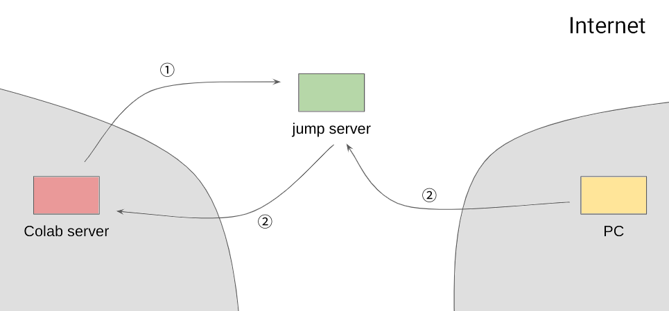

Google Colab 提供了免费的服务器资源。然而，Google Colab 只提供了网页的操作界面，不能像平时操作服务器一样在真实的终端中输入命令。为此，可以借助中转服务器，使用 ssh 连接 Google Colab。

# 实现思路

为了通过 ssh 连接 Google Colab，需要一个有公网 IP 的中转服务器。通过端口转发，将 Google Colab 的 ssh 端口转发到中转服务器上，然后在 PC 上通过中转服务器连接 Google Colab。



# 实现步骤

## 查看 PC 的 SSH 公钥

在 PC 执行以下命令查看 SSH 公钥：

```sh
cat ~/.ssh/id_rsa.pub
```

## 配置 Google Colab

在 Google Colab 单元格中执行以下命令：

```python
%%sh
mkdir -p ~/.ssh
echo '<PC 的 SSH 公钥>' >> ~/.ssh/authorized_keys
apt update > /dev/null
yes | unminimize > /dev/null
apt install -qq -o=Dpkg::Use-Pty=0 openssh-server pwgen net-tools psmisc pciutils htop neofetch zsh nano byobu > /dev/null
ssh-keygen -t rsa -N "" -f ~/.ssh/id_rsa > /dev/null
echo ListenAddress 127.0.0.1 >> /etc/ssh/sshd_config
mkdir -p /var/run/sshd
/usr/sbin/sshd
```

其中，`<PC 的 SSH 公钥>` 需要替换为上一步查看的 SSH 公钥。

## 查看 Google Colab 的 SSH 公钥

在 Google Colab 单元格中执行以下命令查看 SSH 公钥：

```python
!cat ~/.ssh/id_rsa.pub
```

## 将 Google Colab 的 SSH 公钥加入中转服务器

在中转服务器执行：

```sh
echo '<Google Colab 的 SSH 公钥>' >> ~/.ssh/authorized_keys
```

其中，`<Google Colab 的 SSH 公钥>` 需要替换为上一步查看的 SSH 公钥。

## 将 Google Colab 的 SSH 端口转发到中转服务器

```sh
!ssh -N -T -C -o StrictHostKeyChecking=no -R 127.0.0.1:28822:127.0.0.1:22 <user>@<hostname>
```

其中，`<user>` 和 `<hostname>` 分别为中转服务器的用户名和 IP 地址。

## 从 PC 登录 Google Colab

修改 `~/.ssh/config`：

```ini
Host jumpserver
    User <user>
    HostName <hostname>

Host colab
    User root
    HostName 127.0.0.1
    Port 28822
    ProxyJump jumpserver
```

其中，`<user>` 和 `<hostname>` 分别为中转服务器的用户名和 IP 地址。

在 PC 执行以下命令登录 Google Colab：

```sh
ssh colab
```

当重新启动 Google Colab 运行环境时，Google Colab 的 host key 会发生变化，导致无法登录。解决方法是在 PC 执行以下命令，删除原来储存的 host key：

```sh
ssh-keygen -R "[127.0.0.1]:28822"
```

# 配置 Google Colab

## 安装 [Oh My Zsh](https://ohmyz.sh/)

```sh
sh -c "$(curl -fsSL https://raw.github.com/ohmyzsh/ohmyzsh/master/tools/install.sh)"
```

## 修改时区

由于 Google Colab 是 docker 镜像，直接修改时区会发生错误：

```
Failed to create bus connection: No such file or directory
```

可以通过环境变量的方式修改：

```sh
echo 'export TZ=":Asia/Hong_Kong"' >> ~/.zshrc
```

## 安装 Python 3.10

```python
apt install -y software-properties-common
add-apt-repository -y ppa:deadsnakes/ppa
apt install -y python3.10-full python3.10-dev
```

## 使用 Byobu

为了防止 SSH 连接中断后，运行的程序就停止，应该在登录 SSH 后使用 `byobu` 命令打开 Byobu 会话，然后在 Byobu 会话中运行程序。这样即使 SSH 连接中断，重新登录后再次使用 `byobu` 命令就可以恢复原来的会话。

# 常用命令

## 查看系统信息

```sh
neofetch
```

## 查看 CPU 使用情况

```sh
htop
```

## 挂载 Google Drive

在启动 8 小时左右，服务器资源会被回收。为了防止数据丢失，可以定期将中间结果保存到 Google Drive 中。将 Google Drive 挂载到 Google Colab 的方法是在 Google Colab 单元格中执行：

```python
from google.colab import drive
drive.mount('/content/gdrive')
```

然后按提示操作。

## 查看 GPU 型号

在 Google Colab 的单元格中执行以下命令：

```python
import torch
print(torch.cuda.get_device_name())
```

如果 GPU 型号不理想，可以尝试重新启动 Google Colab 运行环境。

## 查看 GPU 使用情况

```sh
LD_LIBRARY_PATH=/usr/lib64-nvidia watch -n 1 nvidia-smi
```

不能直接使用 `export LD_LIBRARY_PATH=/usr/lib64-nvidia`，这样会导致某些程序不能使用 GPU。

## 配置 JAX 使用 TPU

```python
from jax.tools.colab_tpu import setup_tpu
setup_tpu()
print(jax.devices())
```

更多 TPU 用法请参看 [TPU Starter](https://github.com/ayaka14732/tpu-starter)。

（作于 2020&#8239;年&#8239;9&#8239;月&#8239;17&#8239;日，修订于 2022&#8239;年&#8239;4&#8239;月&#8239;16&#8239;日）
