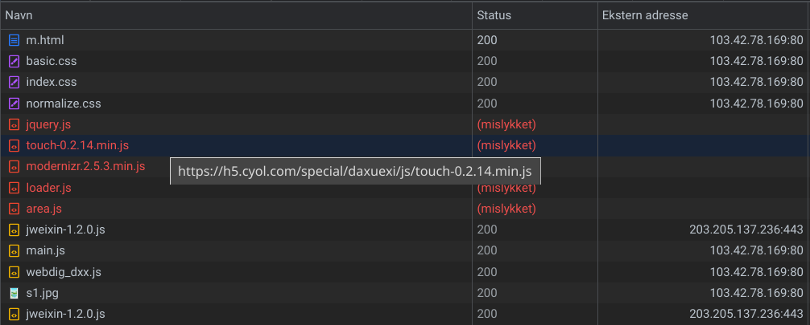
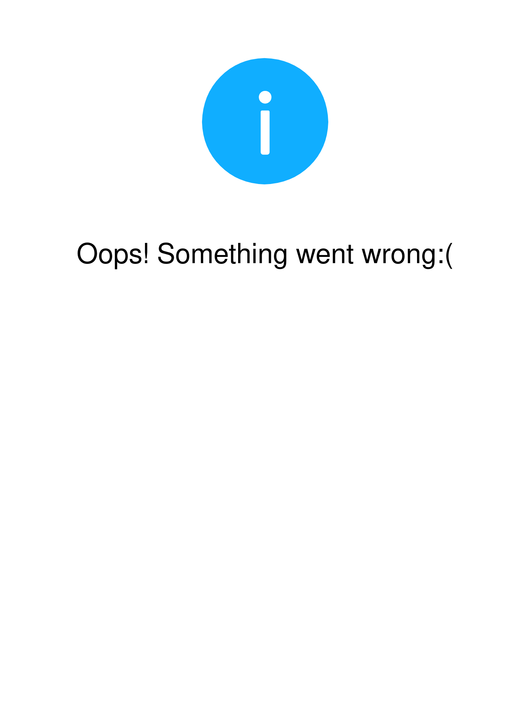
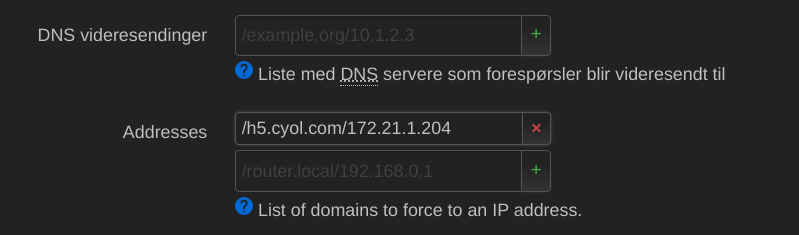
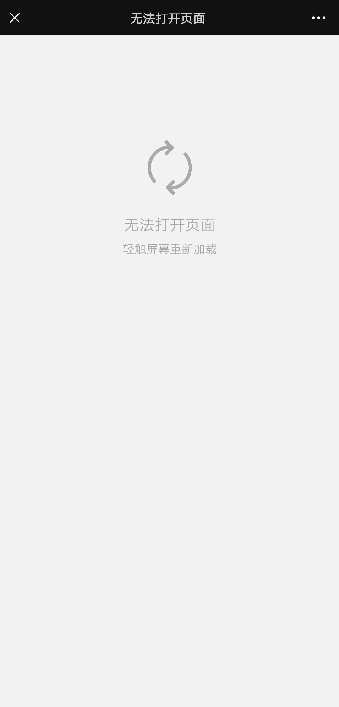
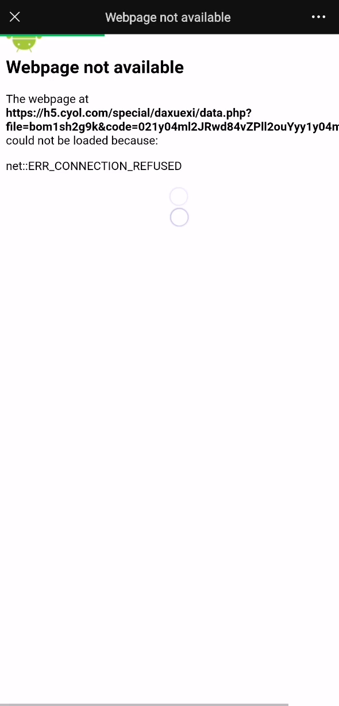

「学习新思想，争做新青年」。今天准备学习青年大学习的时候，却发现网页加载不出来了：


首先想到的是可能是自己的网络问题，于是切换了 Wi-Fi 和手机流量，把各种能想到的办法都尝试了一遍，发现网页还是加载不出来。

这时经过思考，想到网页既然能够显示，说明至少网页本身已经被成功加载了，只是有一部分资源不能被成功加载。点击右上角「复制链接」，粘贴到电脑浏览器中打开，就可以找出不能被成功加载的资源：



原来罪魁祸首是 `jquery.js`, `touch-0.2.14.min.js` 等几个文件。这时，首先想到可以用 [Local CDN](https://addons.mozilla.org/en-US/firefox/addon/local-cdn-webextension/) 之类的浏览器拓展把缺失的文件补上，但是 `loader.js` 和 `area.js` 是网页本身的文件，所以这种方法不行。

正当我一筹莫展之际，发现这个网页的链接是 http 协议，而不能加载的链接都是 https 协议，于是想到可能是协议的问题。将这几个链接的 https 协议改成 http 协议，在浏览器中打开，果然都能正确加载。于是，问题变成了如何使浏览器在加载原网页时就将网页中相应链接的 https 协议重写为 http 协议。

由于原网页是 http 协议，很自然地想到可以利用 nginx 作为代理服务器，然后用 `ngx_http_sub_module` 修改网页中的内容。

获取原网站的服务器 IP 地址：

```sh
$ dig +short A h5.cyol.com
103.42.78.169
```

安装 nginx，打开 nginx 的配置文件，在 server 块内加入以下内容，然后运行 nginx：

```conf
location / {
    proxy_pass http://103.42.78.169;
    proxy_set_header Host $host;

    sub_filter_once off;
    sub_filter_types text/html;
    sub_filter "https://h5.cyol.com/special/daxuexi" "http://h5.cyol.com/special/daxuexi";
}
```

其中，`proxy_pass` 指定了原网站的服务器 IP 地址，`proxy_set_header` 指定了访问原网站的 Host 字段。因为代理服务器是使用 IP 地址而不是域名访问原网站，所以必须手动指定 Host 字段，原网站的服务器才能知道代理服务器请求的是哪个域名的网页。`sub_filter` 是将相应链接的 https 协议重写为 http 协议。

修改 hosts 文件，将原网站的域名指向代理服务器的 IP 地址：

```ini
127.0.0.1 h5.cyol.com
```

在电脑浏览器中刷新，发现网页可以正常打开了。

正当我以为大功告成之时，突然想起我还没有签到。这时再次刷新页面，可以看到「我要签到」按钮，但点击后却出现 [“Oops! Something went wrong:(”]{lang=en-US} 字样：



这是微信的 OAuth 页面，说明要想签到，直接在电脑上打开是不行的，必须在微信中打开网页。为此，需要让手机能使用电脑的代理服务器。

将原来在电脑上修改的 hosts 文件还原。然后，将电脑和手机连接到同一个路由器上，在路由器配置界面将原网站的域名指向电脑的 IP 地址：



这时手机应该会使用电脑的代理服务器了，但是在微信刷新页面，结果却没有变化。

查看 nginx 的日志，发现手机没有连接的记录；用 Wireshark 抓包，也发现手机没有向路由器发送解析原网站的域名的 DNS 请求。由此判断是微信缓存的问题。

参考知乎专栏的文章[《如何正确清理微信缓存？》](https://zhuanlan.zhihu.com/p/71840735)，依次点击「我」、「设置」、「通用」、「微信存储空间」、「清理微信缓存」，即可清理微信缓存。

清理微信缓存之后，青年大学习的网页可以正常打开了，但点击「我要签到」按钮后，却显示「无法打开页面」：



由于此时网页没有被正确加载，所以点击右上角时不会出现「复制链接」按钮，也就无从分析问题产生的原因。这时，发现持续快速点击屏幕时，屏幕上有时会闪过网页的网址，但由于速度太快不能看清楚。为此，使用手机的录屏功能录下这一画面，然后找出对应的那一帧：



由此可以发现又是 https 的问题。原来在原网页中定义了 OAuth 的回调 URL，而回调 URL 是经过 URL 编码的，所以没有被 nginx 修改。

在 nginx 的配置文件中加入：

```conf
    sub_filter "https%3A%2F%2Fh5.cyol.com%2Fspecial%2Fdaxuexi" "http%3A%2F%2Fh5.cyol.com%2Fspecial%2Fdaxuexi";
```

再清除缓存，就可以正常学习青年大学习了：


这次学习青年大学习，我感到非常有意义。不但因为这是我经过不断分析、调试才成功打开的，所以学习得特别认真；而且，这次实践经历加深了我对 Web 技术的理解，对我今后的学习和工作而言都是一笔宝贵的财富。

（2021&#8239;年&#8239;12&#8239;月&#8239;5&#8239;日）
