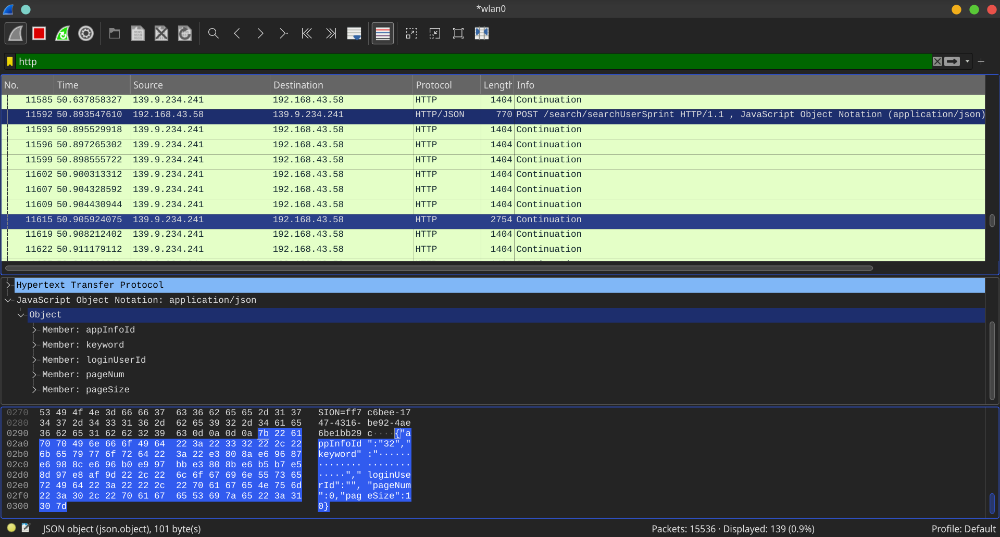

# 服务 900

服务 900 是梅州市广播电视台推出的客家话每日新闻节目。因为播音员的发音比普通人清晰，所以客家话新闻是非常宝贵的客家话资料。

然而，通过网络检索到[梅州市广播电视台 2022&#8239;年&#8239;7&#8239;月&#8239;26&#8239;日《服务 900》完整版](http://news.gdmztv.com/2022/307195.shtml)后，却发现页面上赫然写着「您还没有安装 flash 播放器，请点击这里安装 Adobe Flash Player」字样。Flash 是早已过时的技术，说明网站早已无人维护，而网站内容却还在不断更新，令人唏嘘不已。


为了在网页上使用 Flash，我想到可以使用浏览器的 [Ruffle](https://chrome.google.com/webstore/detail/ruffle/donbcfbmhbcapadipfkeojnmajbakjdc) 插件。然而，安装之后却显示 [“The Ruffle emulator does not yet support ActionScript 3, required by this content”]{lang=en-GB} 字样；即使点击 [“Run anyway”]{lang=en-GB} 按钮，视频也无法成功播放。看来需要深入分析视频的加载过程。


打开控制台，查看载入的资源，可以发现页面载入时会执行 `http://v.gdmztv.com:82//mzt/media/playerJson/vod/84a3c69fba4945fbb342971ff02e2226.js` 这个脚本文件。其中，关于视频播放器的部分如下：

```javascript
/*
 * 创建点播播放器
 * */
function createPlayer(url, videoId, dateString, width, height) {
  if (vmsPlayer.defaults.player_userBrowser == 'iphone' || vmsPlayer.defaults.player_userBrowser == 'unKnow') {
    $S(document).ready(function () {
      var dimension = 'ios';
      createVodPlayerIOS(url, videoId, dateString, dimension, width, height);
    });
  } else if (vmsPlayer.defaults.player_userBrowser == 'android3') {
    $S(document).ready(function () {
      var dimension = 'android';
      createVodPlayer(url, videoId, dateString, dimension, width, height);
    });
  } else if (vmsPlayer.defaults.player_userBrowser == 'android') {
    $S(document).ready(function () {
      var dimension = 'ios';
      createVodPlayerIOS(url, videoId, dateString, dimension, width, height);
    });
  } else {
    $S(document).ready(function () {
      var dimension = 'pc';
      createVodPlayer(url, videoId, dateString, width, height, dimension, 0);
    });
  }
}

function createVodPlayerIOS(url, videoId, dateString, dimension, width, height) {
  var jsonName = url.substring(12);
  dateString = dateString.replace(/-/g, "/");
  var url = vmsPlayer.defaults.player_jsonHost + "/" + dimension + "/" + dateString + "/" + jsonName + ".jsonp";

  if (typeof width != "undefined" && typeof height != "undefined" && width != "@WIDTH@" && height != "@HEIGHT@") {
    //调用html点播播放器
    createHtml5VodPlayer({ url: url, width: width, height: height });
  } else {
    //调用html点播播放器
    createHtml5VodPlayer({url: url, width: vmsPlayer.defaults.player_width, height: vmsPlayer.defaults.player_height});
  }
}
```

从注释可以看出，当客户端为 iOS 时，网页使用的播放器不是 Flash，而是 HTML5，而 HTML5 是目前广泛支持的技术。因此，只要将客户端更换为 iOS，就可以让网页使用 HTML5 播放。

在控制台中选择「切换装置」，然后选择「iPhone SE」，点击刷新。结果发现虽然要求安装 Flash 的字样消失了，但视频播放区域仍为黑屏，仍然无法正常播放。

在控制台中查看网络请求可以发现，在加载视频时，页面请求 `http://v.gdmztv.com:82//mzt/vod/ios/2022/07/26/a34f1b5e19004249900b610e3a133fe7.jsonp?callback=success_jsonpCallback&_=1660968398473` 时失败，服务器返回 404 错误。由于这个资源包含视频地址，页面请求这个资源失败，也就无法得到视频地址，从而导致视频无法播放。

如果不知道视频地址的话，是永远无法播放视频的，而网站上已经没有其他可以利用的信息了，我认为是网站本身的问题，应该向网站反馈。然而，在网站的「[联系我们](http://www.gdmztv.com/about/contact.shtml)」页面上，居然写着联系方式为「待添加」。


正当山穷水尽之时，发现页面侧边有「下载手机 APP」、「微信扫一扫，视频随身看」的悬浮窗，然而悬浮窗内并没有二维码。不过，这一线索提醒了我，可以通过其他方式下载它的手机 App。经过搜索，我成功下载并安装了「无线梅州」手机 App。

打开 App 后，发现确实可以播放视频了。但是，与网站上的内容不同，手机 App 上只有每条新闻分别的视频，而没有每天的完整视频，观看时十分不便。


不过，我由此想到，既然可以播放节选版的视频，就可以知道视频的 URL 格式，再结合网站上完整版的视频 ID，就可以推测出完整版视频的 URL 格式。

点击视频下方的分享按钮，可以看到「复制链接」字样，发现链接是 `http://www2.gdmztv.com/wap/news/416903`，竟然是一个网页，这样问题就变得简单了。


在电脑上打开网页，从控制台中查看到视频的地址为 `http://v8.gdmztv.com:8082/mzt/vod/2022/08/19/aa1dc7d298f34e42b65820d99f4f6a0f/h264_1200k_mp4.mp4`。将这一地址与上面页面请求失败的地址进行比对，发现二者十分相似。因此，只需进行简单的替换，就可以推测出原视频的地址是 `http://v8.gdmztv.com:8082/mzt/vod/2022/07/26/a34f1b5e19004249900b610e3a133fe7/h264_1200k_mp4.mp4`，经过测试，果然能够正常播放。

之后，又经过简单的分析，找到了从网页上推断视频 ID 的方法。因此，要想观看服务 900 完整版，只需在网页上找到视频 ID，并按照 URL 格式替换即可，问题得到完美解决。

# 文昌新闻

在解决了服务 900 的问题后，我又想到了文昌新闻。文昌新闻是文昌市广播电视台推出的海南话新闻节目。由于海南话属于闽语的一支，且海南话本身的语音很有特点，因此海南话具有非常重要的价值。

通过检索发现，网络上有一些零散的文昌新闻视频，标注来源为 <http://www.wenchang.gov.cn/>。而实际访问时可以发现，这个域名的 DNS 已经无法正常解析，而 Internet Archive 的记录显示这个网址早已失效。

此时，我开始怀疑文昌新闻是否仍在继续播出。但是，我心中仍然存有一丝希望，只要能够找到文昌新闻的视频地址，就可以为海南话献出自己的绵薄之力。

有了解决服务 900 播放问题的经验，我想到文昌市广播电视台是否也有自己的手机 App。经过检索，果然发现有「云上文昌」这个 App。但是，打开 App 之后，尽管其中有不少新闻，却没有找到文昌新闻的视频。


我尝试在搜索框中手动输入「文昌新闻」进行检索，果然出现了文昌新闻的视频，可以正常播放，这令我非常激动。但是，这个 App 的搜索功能是模糊检索，不论以「文昌新闻」还是「《文昌新闻》海南话」为关键词进行检索，在出现文昌新闻的同时，都还会出现很多其他有关文昌的新闻。如果要查看过往的文昌新闻视频列表，需要不断下滑检索结果，非常费时费力。


为此，我想找到一种方法，能够自动获取往期文昌新闻的全部视频列表。但是，因为不知道检索时 App 向哪个 URL 发出请求，所以需要通过 Wireshark 抓包进行分析。这个 App 中的所有 URL 使用的都是不加密的 HTTP 协议，所以抓包的方法并不麻烦。

不过这时却出现了一个问题。通常在抓包时，我们是在电脑上运行 Wireshark 程序，在手机上运行要抓包的 App，电脑和手机连接到同一个路由器上，然后在电脑的 Wireshark 程序中登录路由器，在路由器上抓取数据包。但是这次我在外面，使用的是公共的路由器，没有办法登录路由器抓取数据包，所以只能另想办法。

此时，我想到如果在手机上开启热点，让电脑通过手机的热点上网，手机和电脑就处在同一个局域网中，而不需要使用额外的路由器了。但是，这样做产生的问题是，从手机发出的数据包会直接通过移动数据的网卡发送到互联网，这样在电脑上运行的 Wireshark 程序就抓不到对应的数据包；另外，因为我的手机没有 root 权限，所以也不能在 Wireshark 上直接登录手机进行抓包。

这时我想起了 V2Ray 程序。通常而言，我们在使用 V2Ray 程序时会包含一个客户端和一个服务器，达到的效果是客户端的流量会被转发到服务器上，再由服务器的网络进行下一步转发。因此，如果在手机上运行 V2Ray 客户端，电脑上运行 V2Ray 服务器，就可以让手机发出的数据包首先通过电脑，再通过热点转发回手机，然后使用移动数据的网卡发送到互联网，这样电脑上运行的 Wireshark 可以捕获到对应的数据包了。

在配置成功后，我很顺利地通过抓包，找到了云上文昌 App 在检索时使用的 URL 和参数内容。



之后，我又通过编写简单的脚本，实现了自动检索并筛选检索结果的功能，得到了文昌新闻的全部视频列表，问题得到完美解决。

# 后记

解决服务 900 和文昌新闻这两大难题后，时间已是深夜。夜晚，我做了一个梦，梦见客家话和海南话在未来得到了很好的保护。在绿树成荫、花团锦簇的旅游景区里，机器人说着各种方言向游人热情地问好。我走进房间，打开电脑，发现 YouTube 上正播放着当地的方言新闻节目，我赶紧将网址记了下来：

<https://www.youtube.com/channel/UC3vRnsp7tgv5ubvwKLDA-bA>

<https://www.youtube.com/channel/UCo_54F2Xb9lzBcnNkHv-b-w>

（作于 2022&#8239;年&#8239;8&#8239;月&#8239;20&#8239;日）
