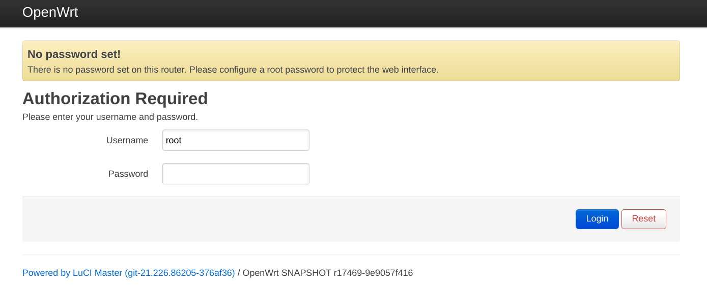

> 本文主要参考 YouTube 视频 [Installing OpenWrt on the Xiaomi 4A, 4C, 3Gv2, 4Q, miWifi 3C and debrick method](https://youtu.be/VxzEvdDWU_s)。
>
> 在网上看到与本文非常类似的 [Win10 下小米路由器 4A 百兆版刷 Openwrt 固件](https://www.cnblogs.com/flytree/p/14812133.html)，但后面的步骤几乎完全不同，读者可以比较参考。

# 背景

为了学习 OpenWrt 购买了小米路由器 4A 百兆版。购买前事先确认了这款路由器可以刷入 OpenWrt 固件，而且可以在不拆机的情况下进行：

- 可以刷入 OpenWrt 固件的路由器：[Table of Hardware](https://openwrt.org/toh/start)
- 小米路由器 4A 百兆版不拆机刷入 OpenWrt 的方法：[acecilia/OpenWRTInvasion](https://github.com/acecilia/OpenWRTInvasion)

# 下载固件

在小米路由器 4A 百兆版对应的官方页面 [Techdata: Xiaomi Mi Router 4A (MIR4A) 100M](https://openwrt.org/toh/hwdata/xiaomi/xiaomi_mi_router_4a_100m) 找到固件的下载链接。可以看到网页上有两个下载链接，分别对应稳定版和 snapshot 版，我使用的是 snapshot 版。

这里需要注意 OpenWrt 的稳定版和 snapshot 版的区别：稳定版默认自带 LuCI 管理界面；而 snapshot 版默认不自带 LuCI 管理界面，需要在刷入 OpenWrt 固件后使用 opkg 包管理器安装 LuCI 管理界面后才可以使用。

此外，官方页面上 snapshot 版的下载链接其实是错误的，打开后会显示 404 Not Found。这时将 URL 结尾的文件名去掉，进入上一级目录，就可以发现文件名并不是 `openwrt-ramips-mt76x8-xiaomi_mir4a-100m-squashfs-sysupgrade.bin`，而是 `xiaomi_mi-router-4a-100m-squashfs-sysupgrade.bin`，这样就可以下载了。另外进入上一级目录还有一个原因，就是进入上一级目录后可以看到文件对应的 sha256sum，以便在刷入前对固件进行校验。如果不进行校验而刷入了损坏的文件，会导致路由器变砖。

# 下载 OpenWRTInvasion 程序

```sh
git clone --depth=1 https://github.com/acecilia/OpenWRTInvasion.git
```

# 电脑连接路由器

使用网线连接电脑和路由器。

然后，根据 OpenWRTInvasion 官方页面 [acecilia/OpenWRTInvasion](https://github.com/acecilia/OpenWRTInvasion) 的描述可知，该程序的 0.0.2 版需要路由器能访问互联网才可以正常运行，所以我在小米路由器 4A 百兆版的管理界面 192.168.31.1 配置了路由器上网。

# 运行 OpenWRTInvasion 程序

根据 OpenWRTInvasion 官方页面的描述，执行以下命令：

```sh
cd OpenWRTInvasion
pip install -r requirements.txt
python remote_command_execution_vulnerability.py
```

在程序运行时需要输入以下内容：

输入路由器的 IP 地址：192.168.31.1。

输入路由器的 stok（在登录小米路由器 4A 百兆版的管理界面后可以看到）。


运行成功后，OpenWRTInvasion 程序会得到 root 权限，并在路由器上开启 telnet 和 ftp 服务器，供下面的步骤使用。登录路由器的用户名和密码均为 root。

# 刷入 OpenWrt 固件

使用 telnet 登录路由器：

```sh
telnet 192.168.31.1
```

使用 ftp 命令行工具上传 OpenWrt 固件（也可以使用 ftp 客户端上传）：

```sh
ftp 192.168.31.1
cd /tmp
put xiaomi_mi-router-4a-100m-squashfs-sysupgrade.bin
```

在 telnet 中校验并刷入固件：

```sh
cd /tmp
./busybox sha256sum xiaomi_mi-router-4a-100m-squashfs-sysupgrade.bin # 校验
mtd -e OS1 -r write xiaomi_mi-router-4a-100m-squashfs-sysupgrade.bin OS1 # 刷入
```

注意此处校验的结果必须与官方页面上显示的 sha256sum 一致才可以刷入。如果不一致，需要重新下载固件再进行刷入。

等待路由器指示灯重新变蓝，表示刷入完成。

# 安装 LuCI 管理界面

如上文所述，由于我使用的是 OpenWrt 的 snapshot 版本，不自带 LuCI 管理界面，因此无法直接通过浏览器进入 LuCI 管理界面。此时需要先使用 ssh 登录路由器，使用 opkg 包管理器安装 LuCI 后，方可进入 LuCI 管理界面。

OpenWrt 默认的 IP 地址是 192.168.1.1。

使用 ssh 登录路由器：

```sh
ssh root@192.168.1.1
```

OpenWrt 默认没有密码，所以不需要输入密码。

更新软件列表并安装 LuCI：

```sh
opkg update
opkg install luci
```

此时出现下载错误，这是因为我的路由器还没有连接互联网。但是，我是使用 Wi-Fi 连接互联网，配置较为复杂，所以我希望在 LuCI 管理界面中配置，而安装 LuCI 却又需要互联网连接，就出现了「鸡生蛋还是蛋生鸡」的问题。

对此，我的解决方法是：首先在电脑上使用 Wi-Fi 连接互联网，然后在电脑上运行 HTTP 代理服务器，接下来再配置路由器上的 opkg 使用电脑上的 HTTP 代理服务器连接互联网，就可以正常下载了。

```sh
sed -i -e "s/https/http/" /etc/opkg/distfeeds.conf
echo option http_proxy http://192.168.1.130:3128/ >> /etc/opkg.conf
```

其中，192.168.1.130 是用网线连接 OpenWrt 路由器和电脑后，电脑获得的 IP 地址；3128 是在电脑上运行的 HTTP 代理服务器的端口号。

# 打开 LuCI 管理界面

使用浏览器打开 192.168.1.1 即可进入 LuCI 管理界面。



（2021&#8239;年&#8239;9&#8239;月&#8239;4&#8239;日）
