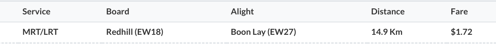

> 注：本文作於 2022&#8239;年&#8239;5&#8239;月&#8239;9&#8239;日，文中所述信息未來可能發生變化，可由文末參考資料獲取最新信息。
>
> [简体中文版](../){lang=zh-CN hreflang=zh-CN}

# 車資規則

基本規則：

1. 依里程收費，巴士與 MRT 同價（車資表見文末）
1. 轉乘時里程累加，不分別計算

轉乘規則：

1. 後繼車程起始時間必須在兩小時以內
1. 最多轉乘五次
1. 不可出閘後由同一地鐵站入閘
1. 不可轉乘同一班巴士
1. 地鐵站之間轉乘必須在 15 分鐘以內
1. 其他轉乘必須在 45 分鐘以內

# 案例分析

**例 1：由武吉士前往勿洛，巴士與 MRT 價格相同**

由於車資只與里程相關，所以乘搭同樣的里程，巴士與 MRT 價格相同。例如，由武吉士前往勿洛，乘搭巴士為 9.1 千米，處於 8.3-9.2 千米區間，所以車資為 1.47 元：

乘搭 MRT 為 9 千米，亦處於 8.3-9.2 千米區間，車資亦為 1.47 元：

雖然巴士與 MRT 價格相同，但用時卻大不相同。如果乘搭 MRT，全程僅需 14 分鐘，而巴士則需要 30 分鐘。但乘搭巴士亦有優點，例如巴士的座位較為舒適。

另外，有時巴士或 MRT 的路綫稍有曲折，導致兩者里程不同，從而導致價格不同，見以下兩個例子。

**例 2：分別乘搭巴士與 MRT 由港灣前往克拉碼頭**

由港灣前往克拉碼頭，由於巴士路綫稍有曲折，里程為 4.7 千米，處於 4.3-5.2 千米區間，所以車資為 1.15 元：

而如果乘搭 MRT，里程為 4 千米，處於 3.3-4.2 千米區間，車資為 1.05 元：

**例 3：分別乘搭巴士與 MRT 由歐南園前往勞明達**

由歐南園前往勞明達，如果乘搭巴士，里程為 4.1 千米，處於 3.3-4.2 千米區間，車資為 1.05 元：

而由於 MRT 路綫稍有曲折，里程為 5.3 千米，處於 5.3-6.2 千米區間，所以車資為 1.25 元：

**例 4：乘搭 MRT 由中峇魯前往女皇鎮，然後轉乘巴士前往 Blk 42**

乘搭 MRT 由中峇魯前往女皇鎮，里程為 2.6 千米，處於 0-3.2 千米區間，車資為 0.95 元；由女皇鎮前往 Blk 42，里程為 0.6 千米，合計里程為 3.2 千米，沒有超出 0-3.2 千米區間，所以不收取車資。

如果第二程超出區間，就需要支付車資，但由於是轉乘，需要支付的車資亦非常少，見下一個例子。

**例 5：乘搭 MRT 由歐南園前往女皇鎮，然後轉乘巴士前往 Blk 42**

乘搭 MRT 由歐南園前往女皇鎮，里程為 4.1 千米，處於 3.3-4.2 千米區間，車資為 1.05 元；由女皇鎮前往 Blk 42，里程為 0.6 千米，合計里程為 4.7 千米，處於 4.3-5.2 千米區間，超出 0-3.2 千米區間，所以支付超出的車資 0.10 元。

**例 6：乘搭 MRT 由紅山前往文禮，再返回**

乘搭 MRT 由紅山前往文禮，里程為 14.9 千米，處於 14.3-15.2 千米區間，車資為 1.72 元。返程如果乘搭 MRT 由文禮返回紅山，不符合「不可出閘後由同一地鐵站入閘」的轉乘條件，所以不視為轉乘，車資為 1.72 元，合計 3.44 元：

而如果返程先乘搭巴士由文禮前往湖畔，再乘搭 MRT 由湖畔前往紅山，則符合轉乘條件，車資合計 2.11 元：

**其他**

針對「不可轉乘同一班巴士」的規則，可以先乘搭一站其他綫路的巴士，再轉乘原來的巴士。

針對「地鐵站之間轉乘必須在 15 分鐘以內」的規則，可以先乘搭一站巴士，這樣就有 45 分鐘的轉乘時間。

有時兩個地鐵站距離較近，但乘搭地鐵很遠（如 DT13 梧槽到 DT22 惹蘭勿剎、DT21 明古連到 CC2 百勝），這時可以利用「地鐵站之間轉乘必須在 15 分鐘以內」的規則，出閘後步行至另一地鐵站入閘。地鐵站間 15 分鐘步行圖如下：

# 附錄：車資表

| 距離（千米） | 票價 |
| :- | :- |
| 0-3.2 | 0.95 |
| 3.3-4.2 | 1.05 |
| 4.3-5.2 | 1.15 |
| 5.3-6.2 | 1.25 |
| 6.3-7.2 | 1.34 |
| 7.3-8.2 | 1.41 |
| 8.3-9.2 | 1.47 |
| 9.3-10.2 | 1.51 |
| 10.3-11.2 | 1.55 |
| 11.3-12.2 | 1.59 |
| 12.3-13.2 | 1.63 |
| 13.3-14.2 | 1.67 |
| 14.3-15.2 | 1.72 |
| 15.3-16.2 | 1.76 |
| 16.3-17.2 | 1.80 |
| 17.3-18.2 | 1.84 |
| 18.3-19.2 | 1.88 |
| 19.3-20.2 | 1.91 |
| 20.3-21.2 | 1.94 |
| 21.3-22.2 | 1.97 |
| 22.3-23.2 | 2.00 |
| 23.3-24.2 | 2.02 |
| 24.3-25.2 | 2.04 |
| 25.3-26.2 | 2.06 |
| 26.3-27.2 | 2.07 |
| 27.3-28.2 | 2.08 |
| 28.3-29.2 | 2.09 |
| 29.3-30.2 | 2.10 |
| 30.3-31.2 | 2.11 |
| 31.3-32.2 | 2.12 |
| 32.3-33.2 | 2.13 |
| 33.3-34.2 | 2.14 |
| 34.3-35.2 | 2.15 |
| 35.3-36.2 | 2.16 |
| 36.3-37.2 | 2.17 |
| 37.3-38.2 | 2.18 |
| 38.3-39.2 | 2.19 |
| 39.3-40.2 | 2.20 |
| 40.3- | 2.21 |

# 常用工具

1. Google Map：實時計劃路綫
1. Bus Uncle 查詢巴士的到達時間：https://t.me/sgbusunclebot
1. 車資計算器：https://www.lta.gov.sg/content/ltagov/en/map/fare-calculator.html

# 參考資料

1. 轉乘規則及付款方式：https://www.transitlink.com.sg/travel-fares/
1. 付款方式：https://www.sbstransit.com.sg/fares-and-concessions
1. 車資表（2021&#8239;年&#8239;12&#8239;月&#8239;26&#8239;日起生效）：https://landtransportguru.net/fare-review-exercise-2021-flyer-front/
1. 15 分鐘轉乘圖：https://mothership.sg/2018/03/new-transfer-rules-trains-lower-fares/

（2022&#8239;年&#8239;5&#8239;月&#8239;9&#8239;日）
