> 注：本文作于 2022&#8239;年&#8239;5&#8239;月&#8239;9&#8239;日，文中描述的信息未来可能发生变化，可以根据文末的参考资料获取最新的信息。

# 车费规则

基本规则：

1. 按里程收费，巴士与 MRT 同价（车费表见文末）
1. 换乘时里程累加，不分别计算

换乘规则：

1. 后继车程的起始时间必须在两小时以内
1. 最多换乘五次
1. 不可以出站后从同一地铁站进站
1. 不可以换乘同一路车
1. 地铁站之间换乘必须在 15 分钟以内
1. 其他换乘必须在 45 分钟以内

# 案例分析

**例 1：由武吉士前往勿洛，巴士与 MRT 价格相同**

由于车费只与里程有关，所以乘坐同样的里程，巴士与 MRT 的价格相同。例如，由武吉士前往勿洛，乘巴士为 9.1 千米，处于 8.3-9.2 千米的区间内，所以车费为 1.47 元：

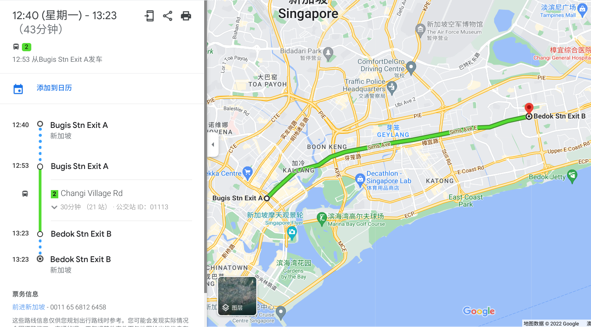

乘 MRT 为 9 千米，也处于 8.3-9.2 千米的区间内，所以车费也为 1.47 元：

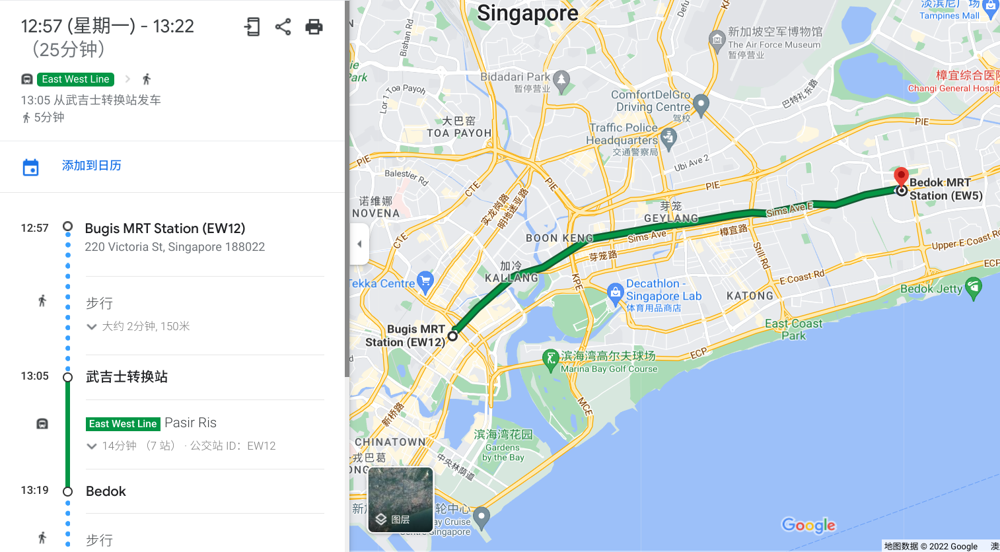

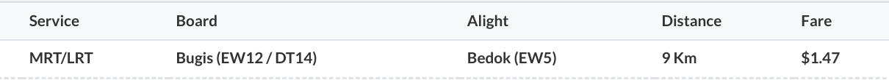

虽然巴士和 MRT 两者价格相同，但用时却大不相同。如果乘坐 MRT，全程只需要 14 分钟，而巴士需要 30 分钟。不过乘坐巴士也有优点，比如座位比较舒服。

另外，有时巴士或 MRT 的路线稍有曲折，导致两者里程不同，从而导致价格不同，见下面两个例子。

**例 2：分别乘巴士和 MRT 由港湾前往克拉码头**

由港湾前往克拉码头，由于巴士路线稍有曲折，里程为 4.7 千米，处于 4.3-5.2 千米的区间，所以车费为 1.15 元：

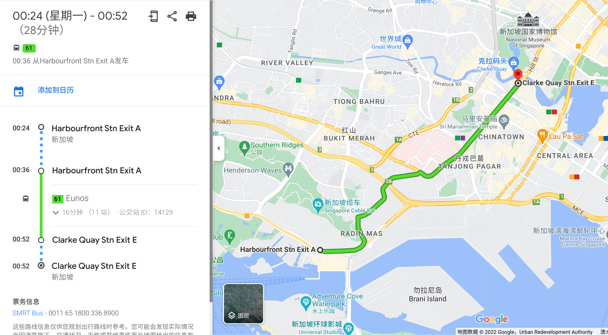

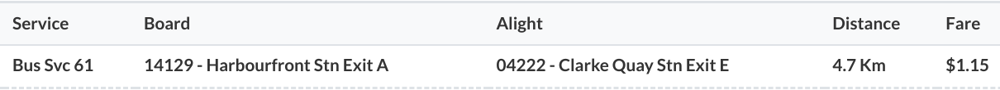

而如果乘 MRT，里程为 4 千米，处于 3.3-4.2 千米的区间，车费为 1.05 元：

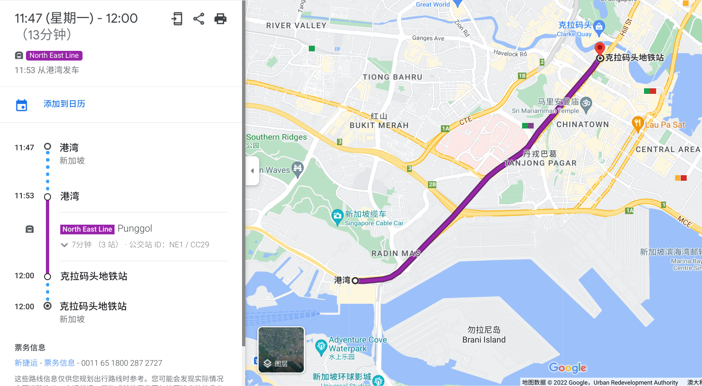

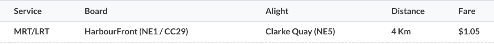

**例 3：分别乘巴士和 MRT 由欧南园前往劳明达**

由欧南园前往劳明达，如果乘巴士，里程为 4.1 千米，处于 3.3-4.2 千米的区间，车费为 1.05 元：

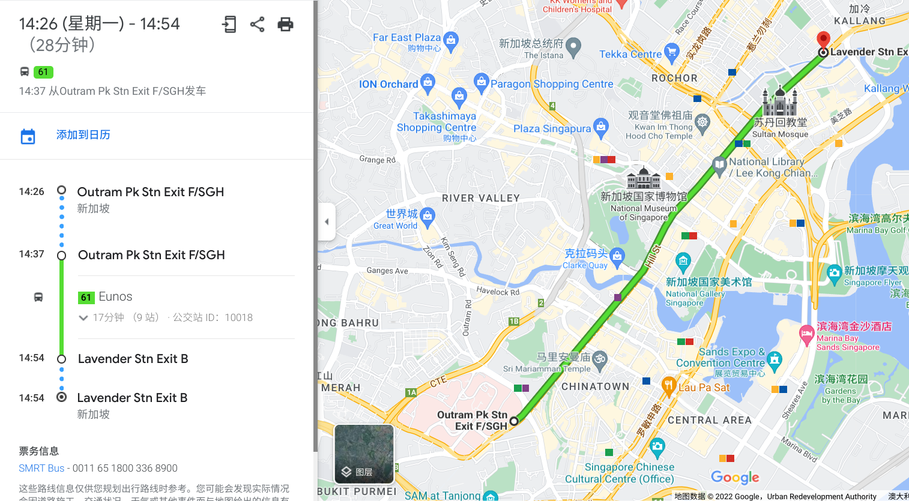

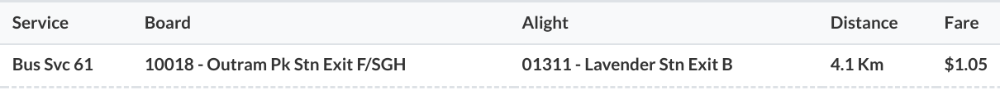

而由于 MRT 路线稍有曲折，里程为 5.3 千米，处于 5.3-6.2 千米的区间，所以车费为 1.25 元：

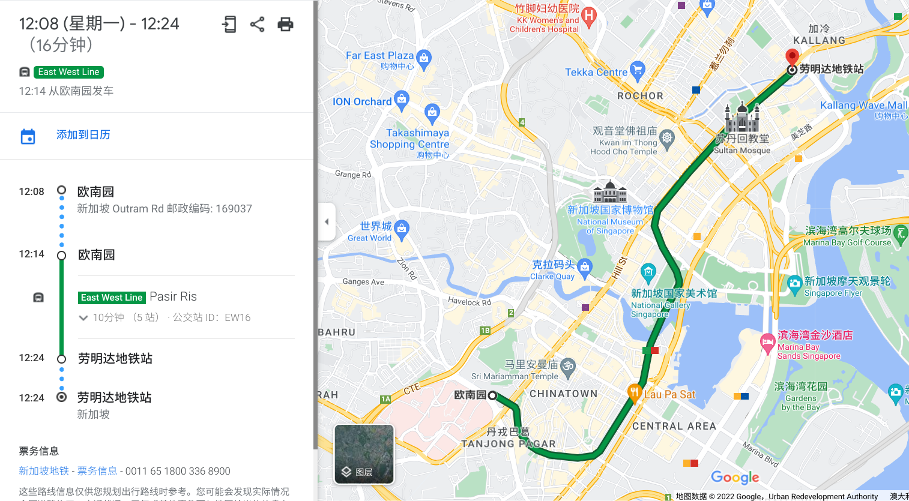

**例 4：乘 MRT 由中峇鲁前往女皇镇，然后换乘巴士前往 Blk 42**

乘 MRT 由中峇鲁前往女皇镇，里程为 2.6 千米，处于 0-3.2 千米的区间，车费为 0.95 元；由女皇镇前往 Blk 42，里程为 0.6 千米，合计里程为 3.2 千米，没有超出 0-3.2 千米的区间，所以不收车费。

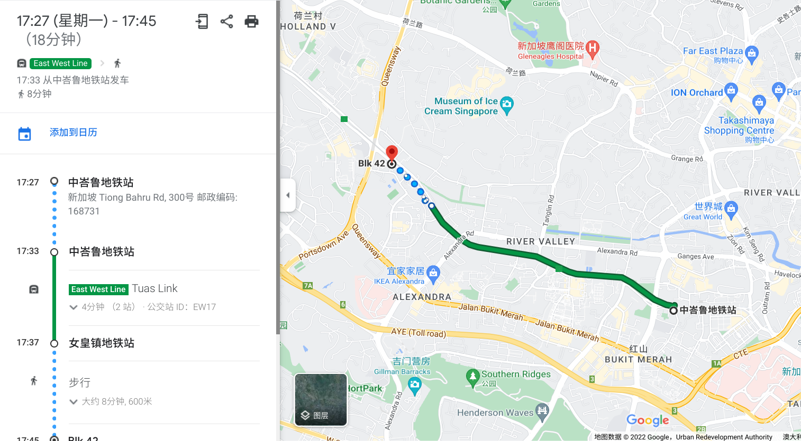

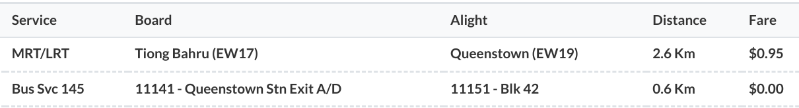

如果第二程超出了原来的区间，就需要支付车费，但由于是换乘，需要支付的车费也非常少，见下一个例子。

**例 5：乘 MRT 由欧南园前往女皇镇，然后换乘巴士前往 Blk 42**

乘 MRT 由欧南园前往女皇镇，里程为 4.1 千米，处于 3.3-4.2 千米的区间，车费为 1.05 元；由女皇镇前往 Blk 42，里程为 0.6 千米，合计里程为 4.7 千米，处于 4.3-5.2 千米的区间，超出了 0-3.2 千米的区间，所以支付超出的车费 0.10 元。

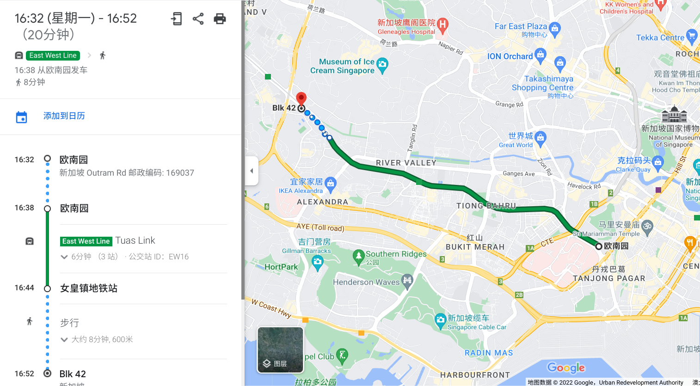

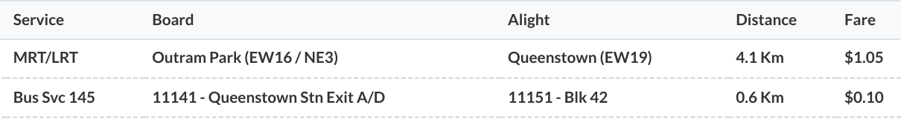

**例 6：乘 MRT 由红山前往文礼，再返回**

乘 MRT 由红山前往文礼，里程为 14.9 千米，处于 14.3-15.2 千米的区间，车费为 1.72 元。返程如果乘 MRT 由文礼返回红山，不符合「不可以出站后从同一地铁站进站」的换乘条件，所以不算换乘，车费为 1.72 元，合计 3.44 元：

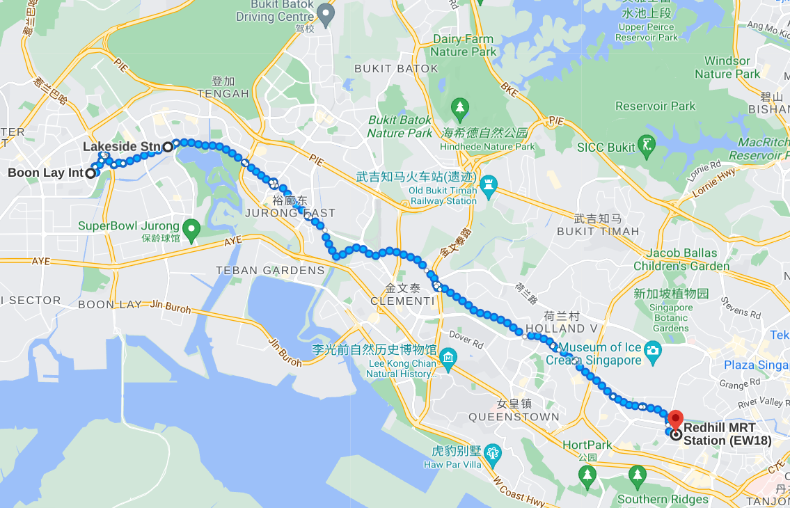

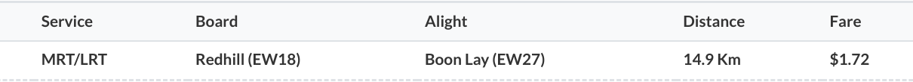

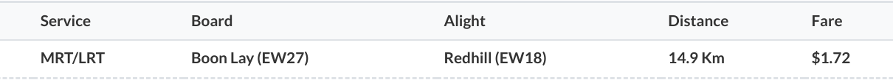

而如果返程先乘巴士由文礼前往湖畔，再乘 MRT 由湖畔前往红山，就符合换乘条件，车费合计 2.11 元：

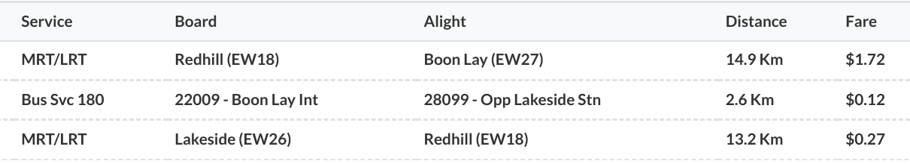

**其他**

针对「不可以换乘同一路车」的规则，可以先坐一站其他车，再换乘原来的车。

针对「地铁站之间换乘必须在 15 分钟以内」的规则，可以先坐一站其他车，这样就有 45 分钟的换乘时间。

有时两个地铁站距离较近，但乘地铁很远（如 DT13 梧槽到 DT22 惹兰勿刹、DT21 明古连到 CC2 百胜），这时可以利用「地铁站之间换乘必须在 15 分钟以内」的规则，出站后步行至另一个地铁站进站。地铁站间 15 分钟步行图如下：

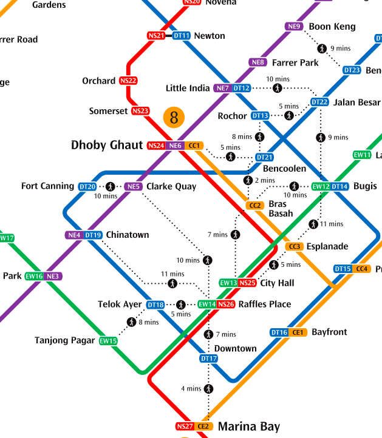

# 附录：车费表

| 距离（千米） | 票价 |
| :- | :- |
| 0-3.2 | 0.95 |
| 3.3-4.2 | 1.05 |
| 4.3-5.2 | 1.15 |
| 5.3-6.2 | 1.25 |
| 6.3-7.2 | 1.34 |
| 7.3-8.2 | 1.41 |
| 8.3-9.2 | 1.47 |
| 9.3-10.2 | 1.51 |
| 10.3-11.2 | 1.55 |
| 11.3-12.2 | 1.59 |
| 12.3-13.2 | 1.63 |
| 13.3-14.2 | 1.67 |
| 14.3-15.2 | 1.72 |
| 15.3-16.2 | 1.76 |
| 16.3-17.2 | 1.80 |
| 17.3-18.2 | 1.84 |
| 18.3-19.2 | 1.88 |
| 19.3-20.2 | 1.91 |
| 20.3-21.2 | 1.94 |
| 21.3-22.2 | 1.97 |
| 22.3-23.2 | 2.00 |
| 23.3-24.2 | 2.02 |
| 24.3-25.2 | 2.04 |
| 25.3-26.2 | 2.06 |
| 26.3-27.2 | 2.07 |
| 27.3-28.2 | 2.08 |
| 28.3-29.2 | 2.09 |
| 29.3-30.2 | 2.10 |
| 30.3-31.2 | 2.11 |
| 31.3-32.2 | 2.12 |
| 32.3-33.2 | 2.13 |
| 33.3-34.2 | 2.14 |
| 34.3-35.2 | 2.15 |
| 35.3-36.2 | 2.16 |
| 36.3-37.2 | 2.17 |
| 37.3-38.2 | 2.18 |
| 38.3-39.2 | 2.19 |
| 39.3-40.2 | 2.20 |
| 40.3- | 2.21 |

# 常用工具

1. 谷歌地图：实时规划路线
1. Bus Uncle 查巴士的到达时间：https://t.me/sgbusunclebot
1. 车费计算器：https://www.lta.gov.sg/content/ltagov/en/map/fare-calculator.html

# 参考资料

1. 换乘规则和支付方式：https://www.transitlink.com.sg/travel-fares/
1. 支付方式：https://www.sbstransit.com.sg/fares-and-concessions
1. 车费表（2021&#8239;年&#8239;12&#8239;月&#8239;26&#8239;日起生效）：https://landtransportguru.net/fare-review-exercise-2021-flyer-front/
1. 15 分钟换乘图：https://mothership.sg/2018/03/new-transfer-rules-trains-lower-fares/

（2022&#8239;年&#8239;5&#8239;月&#8239;9&#8239;日）
